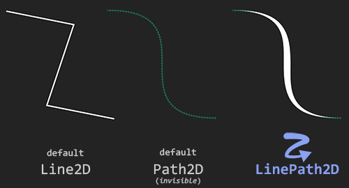
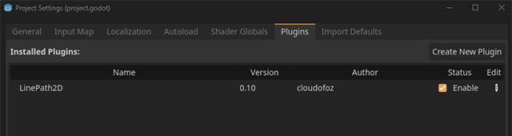
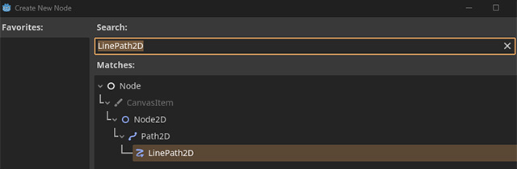
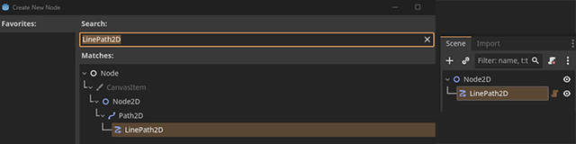
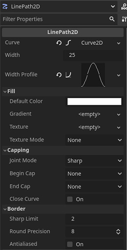

 

## godot-linepath-2d
**This simple Godot addon brings the `Line2D` drawing capabilities to `Path2D` curves.**

 

  
  
  

## Getting Started

1. Download the **[repository](https://github.com/cloudofoz/godot-linepath-2d/archive/refs/heads/main.zip)** or download the (stable) addon from the AssetLib in Godot (**[link](https://godotengine.org/asset-library/asset/2630)**).
2. Import the **addons** folder into your project.
4. Activate `LinePath2D` under * *Project > Project Settings > Plugins.* *
   
 
     
   

6. Add a `LinePath2D` node to the scene.
   
 
     
     
   

7. Tweak `LinePath2D` parameters to set your curve style
   
 
     
   

8. Enjoy!
   
## License

[MIT License](/LICENSE.md)
